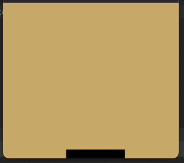
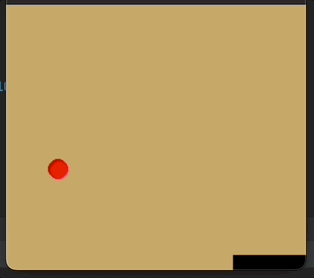
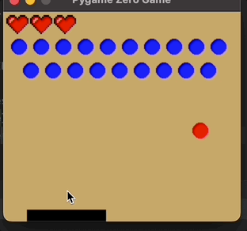
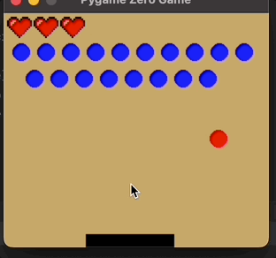

# 🎓 Практична робота №8 (додаткова): Робота зі сторонніми бібліотеками

В цій роботі вам пропонується на вибір попрацювати або з бібліотекою створення ігор `PyGame`, або з бібліотеками для обробки та візуалізації даних - `numpy`, `pandas` та `matplotlib`. Перед кожною роботою є посилання на лекції минулого року, які можна подивитись для базового ознайомлення з матеріалом.

## Варіант А. Різдвяний арканоїд

### Мета роботи:
На практиці спробувати написати першу не консольну програму на Python, розібратися з бібліотекою PyGame Zero, виориставши наявні знання з программування та математики створити гру.

## Загальний опис
Арканоід - дуже відома та стара гра, вперше створена ще для аркадних автоматів у 1986 році. Детальніше прочитати про історію гри можна на [вікі](https://en.wikipedia.org/wiki/Arkanoid), зіграти в оригінальну версію (обережно, дуже складно!) - [тут](https://www.free80sarcade.com/arkanoid.php). Ми з вами створимо у якості вправи просту версію цієї гри

## Завдання

#### Лекції:

[Лекція за 6.12.22 (з 48 хвилини)](https://youtu.be/wLMWJdYwxoI?si=egCuVbbpoxIctL1N&t=2927)

[Лекція за 13.12.22 (з 55 хвилини)](https://youtu.be/fkk-qtI3oTs?si=hxzOpc5QLqh7sp5h&t=3300)

[Лекція за 20.12.22 (з початку)](https://www.youtube.com/watch?v=PG-LcjUUSGE)
#### Підготовка до виконання

Pygame Zero не відноситься до стандартних бібліотек, що йдуть разом з інтерпретатором Python, тому вам потрібно встановити його окремо. Для цього відкрийте термінал (системний або вбудований в PyCharm через `View > Tool Windows > Terminal`) та ввести команду `pip install pygame`


#### Основи

Розпочніть створення програми із стандартної заготовки, з якої ми починаємо створення додатків на Pygame Zrto. Пригадайте, які функції виконує цей код і для чого потрібні методи `draw()` та `update(dt)`:

```Python
import pgzrun

WIDTH = 600
HEIGHT = 800


def draw():
    pass


def update(dt):
    pass


pgzrun.go()
```

Додайте у проект рухому платформу (назвіть цей класс `Paddle`) знизу екрану, яка рухається ліворуч та праворуч за мишкою. Для цього вам може знадобитись метод `on_mouse_move(pos)`, який працює по аналогії з `on_mouse_down(pos)` але викликається зажди коли курсор рухається у грі.
<p align="center">
 
</p >

Далі, додайте мʼяч, який рухається по прямій та відбивається від стінок ігрового поля. При відбиванні кут під яким мʼяч відлітає від стінки має дорівнювати куту

<p align="center">
 
</p >

Тепер час додати життя - кожного разу, коли мʼяч торкається нижньої поверхні ігрового поля поза платформою, позиція мʼяча має скидатись, а гравець втрачати одне життя. Коли життів не лишилося, гра програна (виведіть на екран великими літерами `GAME OVER`)

<p align="center">
 
</p >

Тепер найцікавіше - перешкоди. В оригінальній грі ці перешкоди прямокутні, але ми зробимо круглі, оскільки знаходження перетину двох кіл простіше реалізувати. Для початку, додайте в гру нову сутність `Obstacle`, що виглядає як коло та розмістіть набір цех перешкод на ігровому полі. Можете самостійно обрати їх кількість та позиції

На першому етапі, зробіть так що якщо мʼяч налітає на перешкоду, то він її знищує і при цьому не змінює траекторії руху. Це дозволить вам зробити повноцінну гру, в якій можна виграти або програти - необхідно просто рахувати кількість перешкод на полі, і якщо гравець знищив усі, виводити надпис `YOU WON!`

<p align="center">
 
</p >

І найцікавіше наостанок - якщо мʼяч врізається в перешкоду, то він відлітає по напрямку від центру перешкоди. З цим фукнціоналом гра повністю готова! Лишилось тільки підібрати такі параметри швидкості мʼяча, щоб від гри лишались приємні відчуття.

<p align="center">
 
</p >

> Таким чином, наприкінці виконання у вас в проекті мають бути класи `Paddle`, `Ball` та `Obstacle`. Ви можете знайти велику кількість туторіалів про арканоїди на PyGame Zero в інтернеті та можете користуватися ними з довідковою метою (а можете ще приходити з питаннями на офісні години), але структура роботи яку ви здаєте має бути у відповідності саме до нашого завдання. Копіювання коду з туторіалів не допускається


## Корисні посилання
- офіційна документація по [PyGame Zero](https://pygame-zero.readthedocs.io/en/stable/introduction.html)

## Контрольні питання
1. Що таке клас та екземпляр класу?
2. Що роблять методи `__init__`  та `__str __`?
3. Що означає параметр dt у функції `update`?
4. Що означає параметр `self`?

## Оцінювання
Максимальний бал - 6:
- 1 бал - рухома платформа, мʼяч що відскакує від стін та платформи;
- 1.5 бали - відскакування від круглих перешкод;
- 1.5 бали - підрахунок перешкод, можливість виграти та програти;
- 1 бал - відповіді на питання при здачі;
- 1 бал - виконання практичного завдання при здачі.

## Варіант В. Що по Нетфліксу?

### Мета роботи:
На практиці спробувати попрацювати з трьома популярними допоміжними біліотеками для Python - `NumPy`, `Pandas` та `MatPlotLib`. Виконати завдання з обробки табличних даних використовуючи загальноприйняті інструменти.

## Загальний опис

Всі попередні завдання були орієнтовані на опанування вами мови програмування Python та були заточені на вивчення певного аспекту мови, типу завдань чи підходу. Попереднє завдання - арканоід - приклад тієї роботи, яку ви будете виконувати якщо у подальшій кар'єрі приймете рішення займатися розробкою програмного забезпечення.

В цій же, останній в курсі роботі ми зайдемо з іншої сторони та зробимо практичну, так ніби ви працюєте аналітиком і ваша основна ціль - аналіз даних, а Python - один з багатьох допоміжних інструментів що є у вас в наявності.

## Підготовка до виконання
В цій роботі ви не зобов'язані користуватися сторонніми бібліотеками, проте їх використання значно спростить вам саме завдання та скоротить час його виконання. Крім того, ви завжди можете комбінувати використання бібліотек з усіма "звичайними" прийомами роботи з Python, які ви знаєте.

Під час виконання рекомендується користуватися офіційними довідками, а також подивитись [відео лекції](https://www.youtube.com/watch?v=QuOC277bQeo)
:
- [NumPy: the absolute basics for beginners](https://numpy.org/doc/stable/user/absolute_beginners.html#numpy-the-absolute-basics-for-beginners)
- [Pandas Getting Started tutorials](https://pandas.pydata.org/docs/getting_started/intro_tutorials/index.html)
- [MatPlotLib Quick start guide](https://matplotlib.org/stable/tutorials/introductory/quick_start.html)

Оскільки ці бібліотеки мають величезну кількість можливостей, ситуація коли для виконання якоїсь дії потрібно спочатку пошукати в офіційній документації як це робиться є нормальною та цілком частою у роботі аналітика.


## Завдання
В цьому завданні ми будемо аналізувати фільми та серіали, [доступні на Netflix станом на липень 2022 року](https://www.kaggle.com/datasets/victorsoeiro/netflix-tv-shows-and-movies?select=titles.csv). В одній з попередніх робіт ми вже користувалися базою датасетів _Kaggle_, цей ресурс вже має бути для вас знайомим. Зверніть увагу - датасет складається з двох таблиць - однієї з загальною інформацією і однієї з даними про акторів та режисерів.

В цьому завданні вам не потрібно реалізовувати парсер аргументів командного рядка, достатньо зробити окремі функції для окремих підзавдань

Отже, скачавши датасет за посиланням вище, виконайте наступні завдання:
1. Побудуйте окремі гістограмми розподілу фільмів та серіалів за оцінкою IMDB з кроком у 0.2 бали. У кого вища середня оцінка? - _0.5 бали_;
2. Побудуйте pie-chart вікових рейтингів серед усіх шоу доступних та платформі - _0.5 бали_;
2. **Найвдаліший рік для кіно**. Для років починаючи з 2000, побудуйте графік відсотку фільмів та шоу що мають рейтинг, більший за 8.0 в залежності від року (вісь `x` - роки, `y` - відсоток). Назвіть найуспішніший рік - _1 бал_;
3. **Рейтинг акторів, що знімаються в гарних фільмах**. Використавши дані обох таблиць, візміть топ-1000 фільмів на платформі за рейтингом imdb, та наведіть топ-10 акторів за кількістю фільмів серед цієї тисячі. - 1 бал;
4. Для тієї ж топ-1000, побудуйте жанровий bar-chart, скільки фільмів та шоу мають певну категорію (drama, action, romance, etc.) - _1 бал_.

## Контрольні питання
1. Що таке `DataFrame`?
2. Яким чином можна зобразити графіки різних типів у MatPlotLib?
3. Яким чином можна отримати тільки певний рядок або стовбчик з `.csv` файлу?
4. Що так `ndarray` у NumPy?
5. Що означає аннотація `@dataclass`?

## Оцінювання
Максимальний бал - 6:
- 4 бали - виконання завдань відповідно до описаних вище балів;
- 1 бал - відповіді на питання при здачі;
- 1 бал - виконання практичного завдання при здачі.


